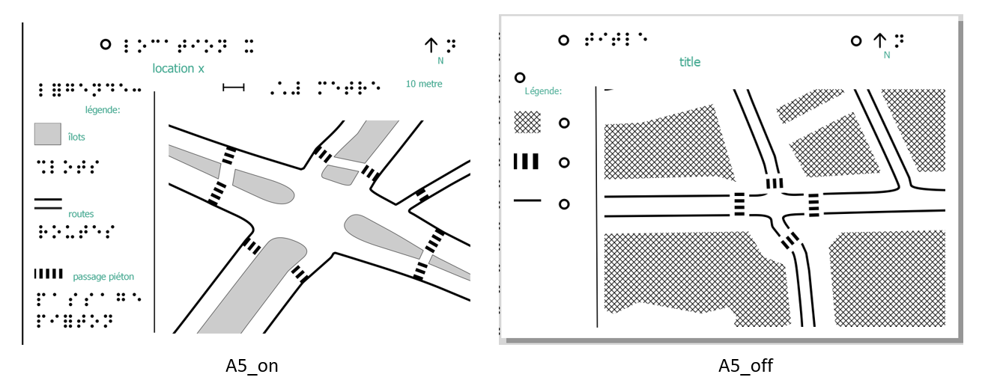
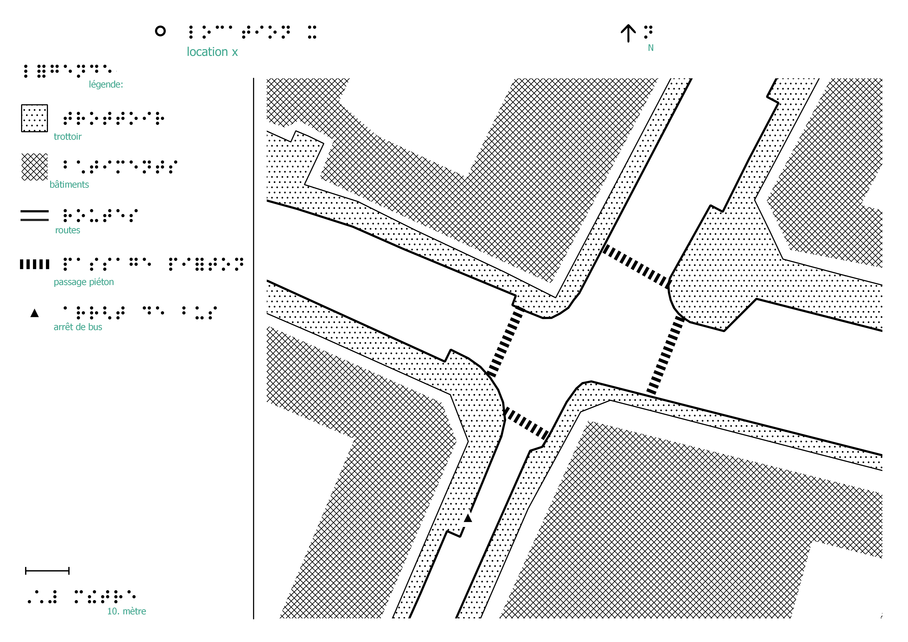
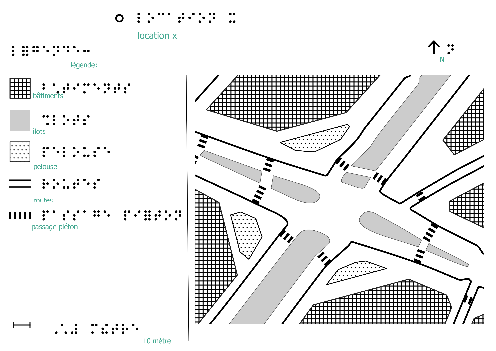

# tactile maps for street intersections

## set-ups

**The scripts are developed on a Windows machine. It could work differently on other systems especially the pyQGIS / gdal part. Modify accordingly**. 

### requirements

- geopandas (0.10.2)
- shaply (1.7.0)
- networkx (2.2)
- gdal/ogr (3010400)
- numpy (1.19.1)
- pyqgis

Set up PyQGIS on Windows like this [this](https://anitagraser.com/2019/03/03/stand-alone-pyqgis-scripts-with-osgeo4w/) or [this (for conda)](https://anitagraser.com/2023/01/21/pyqgis-jupyter-notebooks-on-windows-using-conda/). And in the `qgis_env.json` file, change the paths accordingly:

```json
{
"PROJ_LIB": "C:\\OSGeo4W64\\share\\proj", //
"PROJ_DEBUG": "3", // can keep it like this, doesn't bother
"QT_QPA_PLATFORM_PLUGIN_PATH": "C:\\OSGeo4W64\\apps\\Qt5\\plugins",  // the Qt plug in folder
"PATH": ["C:\\OSGeo4W64\\apps\\qgis\bin", "C:\\OSGeo4W64\\apps\\Qt5\bin"],  // apps\\qgis\bin folder, and apps\\Qt5\bin folder 
"setPrefixPath": "C:\\OSGeo4W64\\apps\\qgis-dev", // apps\\qgis-dev folder
"PathAppend": "C:\\OSGeo4W64\\apps\\qgis-dev\\python\\plugins" // apps\\qgis-dev\\python\\plugins folder
}
```

**A Braille font (Braille TBFr2007 IHS HEA thermo) is required** to be installed on the machine to print the braille characters. This font can be [downloaded here](http://natbraille.free.fr/ressources/fonts/BrailleTBFr2007INSHEAb_thermo.ttf), and also provided in the `templates` folder. 

### file structure of the repo

```
repo/
├── example_0/  # intersection instance
│ ├── data/
│────└── 500/ # the geometries for 1:500 maps
│────└── 1000/  # geometries for 1:1000 maps
│────└── temp/ # temporary folder for processing results
│────└── map.osm  # the OSM file for this location
│────└── xyz.geojson # scale-independent geometries used during processing
│ └── param.json/  # the param file for this folder
│ ├── image/  # the output folder
├── scripts/  # scripts to be run in order
│ ├── 00_[...].py
│ ├── ...
│ └── 07_[...].py
├── templates/  # default templates and templates elements to print the map with
├── styles/  # default and some alternative styles defined in .qml
├── README.md
```

### the param.json

There is a `param.json` file that contains the parameters used in the scripts. An example of this file and the parameters:

```json
{
    "size_code": "A3",  // "A3", "A4", "A5_on", "A5_off"
    "center_lat": 48.58622,  // lat of the intersection center 
    "center_lon": 7.76322,  // lon of the intersection center
    "line_width": 1, // major line width, in mm
    "line_gap": 3,  // gap between parallel lines, in mm
    "area_gap": 5,  // gap between lines and areas, in mm
    "icon_size": 4,  // point icon size, in mm
    "icon_gap": 3,  // gap around the point, in mm
    "building_level": "rough",  // building generalization level, either "rough" or "detailed"
    "overlay_pref": "direct",  // point-line overlay preference, either "direct" or "displace"
    "object_list": ["building", "sidewalk_area"],  // ROADSIDE objects to include on the map. A3 maps allow max 8, A4 max 4, A5_on max 1, A5_off max 3. Exceeding the number = no map. Now, depending on the location, can choose from: [building, green, sidewalk_area, sidewalk_line, bus_stop] => the name has to be correct!
    "style_list": ["building_default", "line_2"],  // the symbol choice, name from the "style table", in the same order with the objects. 
    "lane_width": 3.5,  // default, don't change this. 
    "epsg": "3857"  // default, don't change this.
}
```

**Now I don't have parameter value checks. So setting funny values would make it crash. Change them only when you know exactly what you are doing.**

### included style files

see `styles\style_samples.png`


### default templates

(note: map legend is in french.)

One A3 and one A4 templates: "standard" templates with braille legend, template design following BANA guidelines. 


two A5 templates:

- the A5_on template with braille legend: it only holds 3 features.
- the A5_off template that removes the braille legend for an interactive dot. Maps in this templates can be integrated with a tablet with a screen reader software that supports reading out the map items. 



## the scripts and the examples

### general steps:

0. get data: export an OSM file, with the intersection in the center, of at least 40m x 40m. save the file under the this_location\data path.
1. modify the param.json: 
   1. determine the out put map size with `size_code`
   2. change the ```center_lat``` and `center_lon` to the coordinates of the intersection center
   3. other things can be left as default. or modify if you know what you are doing
2. for each script, change ```base_folder = r'..\example_0'``` into the intersection folder path (where the `param.json` is)
3. run the scripts by the order number.

### what each script does

*Work in process so there would be bugs. Plus OSM data is unpredictable. Manually check the output from each step to see if it makes sense.*

- 00a_prepare.py: make extent files needed for the following steps
- 00b_pre_process.py: extract data from `map.osm` to the data folder, do some other scale independent transformations on the street data.
- 01_street.py: transform the streets, get area sidewalk if available. outputs are in the folder of the corresponding scale
  - `street_boundary_filled.geojson` as the main street file
  - `island_full.geojson` if traffic island is present at this location
  - `sidewalk_gen.geojson` if area sidewalk is present
- 02_pedestrian_crossing.py: make pedestrian crossing lines
  - `crossing_lines.geojson`
- 03_island_split.py: **before running this, check the** `island_full.geojson` **file and edit the "split" attribute for each island if the island is a cut-through**
  - `islands_split.geojson`
- 04_point_overlay.py: place the bus stop, displace or direct overlay
  - `bus_stop_overlay.geojson`

- 05_sidewalk_lines.py: make sidewalk lines (if available)
  - `sidewalk_lines.geojson`  => this is a tricky step and can go wrong easily now. manual curation needed. 
- 06a_buildings.py: make generalized buildings
  - `building_gen.geojson`
- 06b_green.py: generalize the green areas
  - `green_gen.geojson`
- 07_assembly.py: put the geometry and the styles together in the template, output both png and pdf in the `image` folder
  - e.g. `A3.pdf` and `A3.png`


### example 0: a simpler 4 way crossing, with area sidewalk data

A3 map, use this param setting:

```json
{"size_code": "A3", 
"center_lat": 48.81802,
"center_lon": 2.32231,
"line_width": 1, 
"line_gap": 3, 
"line_area_gap": 4,
"area_gap": 5, 
"icon_size": 4, 
"icon_gap": 3,
"building_level": "rough",
"overlay_pref": "direct",
"object_list": ["building", "sidewalk_area", "bus_stop"],
"style_list": ["building_default", "sidewalk_area_default", "bus_stop_default"],
"lane_width": 3.5, 
"epsg": "3857"}
```

config the scripts with ```base_folder = r'..\example_0'``` 

run scripts 00a - 00b - 01 - 02 - 04 - 06a - 07

output A3 map:



### example 1: a more complex 5 way crossing with traffic islands

A3 map with detailed building footprint, use this param setting:

```json
{"size_code": "A3", 
"center_lat": 48.58630,
"center_lon": 7.76322,
"line_width": 1, 
"line_gap": 3, 
"area_gap": 5, 
"icon_size": 4, 
"icon_gap": 3,
"building_level": "detailed",
"overlay_pref": "direct",
"object_list": ["building", "green", "sidewalk_line"],
"style_list": ["building_default", "green_default", "sidewalk_line_default"],
"lane_width": 3.5, 
"epsg": "3857"}
```

run the scripts 00a - 00b - 01 - 02 

open the file `data\500\islands_full.geojson` and edit the `split=1` for island with `level_1 id` 3, 11, 13 (or edit this in QGIS.)

continue to run the scripts 03 - 05 - 06a - 06b - 07

A3 map at output:

Same procedure (and edit the `islands_full.geojson` in the `data\1000`folder!) but with a slightly different size and style: use this param setting:

```json
{"size_code": "A4", 
"center_lat": 48.58630,
"center_lon": 7.76322,
"line_width": 1, 
"line_gap": 3, 
"area_gap": 5, 
"icon_size": 4, 
"icon_gap": 3,
"building_level": "rough",
"overlay_pref": "direct",
"object_list": ["building", "green"],
"style_list": ["area_8", "sidewalk_area_default"],  // force the green area to use the sidewalk texture
"lane_width": 3.5, 
"epsg": "3857"}
```

get this A4 map



## defining your own templates and symbols

Symbols can be defined as .qml files. 

Templates can be designed in QGIS as qpt files. **But**, your own template might not work with the map assembly script. If you modify the exiting template, you can move items without changing their id. 

## sources and other

[BANA guideline on tactile graphics](https://www.brailleauthority.org/tg/web-manual/index.html)

[QGIS on conda](https://anaconda.org/conda-forge/qgis)
